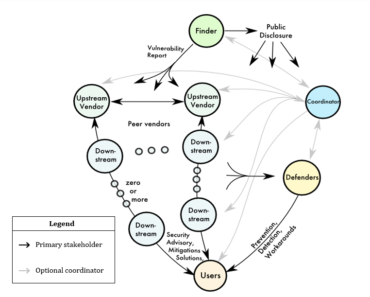

# Flavors of Software Transparency Artifacts

“There are only two hard things in Computer Science:
cache invalidation and naming things.”

Attributed to Phil Karlton circa 1996

This writeup is my attempt at clarifying
the flavors of "stuff" under discussion
in the NTIA Software Transparency
Multistakeholder Working Group.
I am purposely not using the word "SBOM" yet
because it is clear to me that different stakeholders
have different assumptions on the which 'flavor' is meant by that term.
I will use Some-Word-Other-Than-SBOM (SWOTS) in place of SBOM
until we agreed on when to use SBOM,
when to use SBOM with particular qualifiers,
and what words to use for those artifacts we aren't calling SBOMs.
All the 'names' I've chosen are horrible and I hope
someone comes up with better words for each.
This document is to make the point we need to be able to distinguish
the 'flavors' - I don't really care what each flavor is called.

I deliberately used 'artifact' as a catch-all.
I will attempt to use 'writeup' to mean the text you are reading -
so as not to confuse with "documents" that are the artifacts we
are trying to describe.
I will attempt to avoid the use of the word document entirely,
since artifacts may be documents (english text, xml, etc)
but they may not be,
by at least some definitions of the word 'document'
(e.g. JSON data structures in a Machine-to-Machine protocol).
I will attempt to use 'component' to mean 'the thing that
we are being transparent about' and hopefully be able to
avoid whether it is 'mid-stream'
(i.e. downstream of its component parts
yet upstream of some component that used it)
or 'finished good'
(i.e has no downstream components of which it is a component).
I will attempt to use 'transparency artifact' to describe
the 'thingies' coming out of this work.
Yes it's awkward and somebody should come up with better wording.

I believe that we will talk past each other less
if we understand 'which flavor' is under discussion
and what use case it is being used in.

Flavor examples where clarification would be beneficial to
distinguish between:
- ingredients only
- component relationships
- assembly instructions
- component to license relationships
- known-unknowns / incomplete / "one-hop" / "complete"
- component to vulnerability relationships
- component "affected/not-affected" relationship to vulnerability
- has ingredients but not 'sufficient' for SBOM baseline as defined by framing
- has insufficient data for a particular use case (many examples which will need to be un-confounded)

I believe this is one source of our talking past each other,
and that having 'artifact names' will allow us
to better reach consensus on many other topics.

## First Principles
This is just Duncan's opinion.
Assume "IMHO" on every sentence.
Don't mistake passion for intransigence -
change my opinion by presenting alternatives
and reasoning - particularly with use cases/scenarios.
I recognize my experiences prejudice me
and I recognize
there are use cases
beyond the ones I have considered.
Everyone has to operate in their
own frame of reference.
Broaden my mind by alerting me
to your frame of reference.

This writeup has only two parties involved,
the producer of the transparency artifact,
and the consumer of the transparency artifact.
They may be the same
(i.e. transparency artifact is for internal consumption).
The component producer
(i.e. the thing the transparency artifact is about)
is a different role from
this writeup's perspective.
The transparency artifact producer may or may not be the
component producer.
This writeup allows for other-than-component-producer
creating relevant transparency artifacts.
"Authority" to produce a transparency artifact,
and 'trust' of that transparency artifact are out of scope for this writeup.

Everything in this writeup assumes
the transparency artifact producer
and the transparency artifact consumer
have a sufficient trust relationship
for the use cases.
How that is achieved is outside the scope of this writeup.

Everything in this writeup assumes
the transparency artifact producer
has sufficient data to produce the transparency artifact accurately.
Incompleteness is addressed;
but inaccuracy and integrity
are outside the scope of this writeup.

This writeup assumes parties in the use case,
and only the parties in the use case,
have access to the transparency artifact.
How confidentiality is achieved,
(and what level of confidentiality
is appropriate) is out-of-scope.

TL;DR confidentiality, integrity, availability are beyond scope of naming
which transparency artifacts we are talking about in this writeup -
albeit they will introduce more
flavors once they are addressed.

## Big Picture
In Allan's previous life, he championed vulnerability coordination
and FIRST has the following pic on it's website (
https://www.first.org/global/sigs/vulnerability-coordination/multiparty/guidelines-v1.1):

When necessary to define roles,
I will use the roles on this pic
except I will use producer and consumer instead of vendor and user.

## SBOM
I assume there is consensus that the artifact is an SBOM if it
- has the 'baseline'(as defined by the framing group) information, and
- is one of SWID/CycloneDx/SPDX formats, and
- has no 'beyond baseline' information

For lack of a better term, I am going to call this the
'ingredients-only baseline SBOM';
and it will be the only artifact I call an SBOM
since we apparently do not have consensus on whether
these other artifacts should be called SBOMs (maybe with some qualifier)
or we should have different names for some/all of them.

## Complete SBOM
A 'complete' (or full?) SBOM would contain all components,
including going upstream until all components had no further upstream components.
An SBOM that 'known-unknowns'
(e.g. had a component that it was unknown whether it contained any upstream
components) would be a 'incomplete' SBOM.

## "less than baseline" SWOTS
There are transparency artifacts that do not contain enough information
to be considered SBOMs by the definition above.
For example some vendors list components without sufficient identification
to know the version.
Should such artifacts be able to be called SBOMs?
Or should be have a qualifier (eg 'not quite' SBOMs)?
Or should then have a different name entirely.

## Artifacts created by post-processing of SBOMs
I am a proponent of the IACD (Integrated Adaptive Cyber Defense,
https://www.iacdautomate.org/) framework
for vendor-agnostic interoperability and automation.
IACD separates functionality as:
- sensing (gathering information)
- sense making (data augmentation, analytics, ... )
- decision making
- acting

What is the artifact called when the
'ingredients-only baseline SBOM'
is augmented with'beyond baseline' information?
For some stakeholders, it would be advantageous
if these 'beyond baseline' artifacts
went by names other than SBOMs.

### Component to license relationships
If the 'ingredients-only baseline SBOM'

### SBOM +
In the comply-to-connect use case, obtaining the SBOM
(for a device connecting to a network) is sensing.
Combing

## to do
parts list vs bom

"all analogies are wrong, some are useful"

- ingredients only
- assembly instructions
- component to license relationships
- known-unknowns / incomplete / "one-hop" / "complete"
- component to vulnerability relationships
- component "affected/not-affected" relationship to vulnerability
- has ingredients but not 'sufficient' for SBOM baseline as defined by framing
- has insufficient data for a particular use case (many examples which will need to be un-confounded)

instantiation containing components vs 'loose component'
